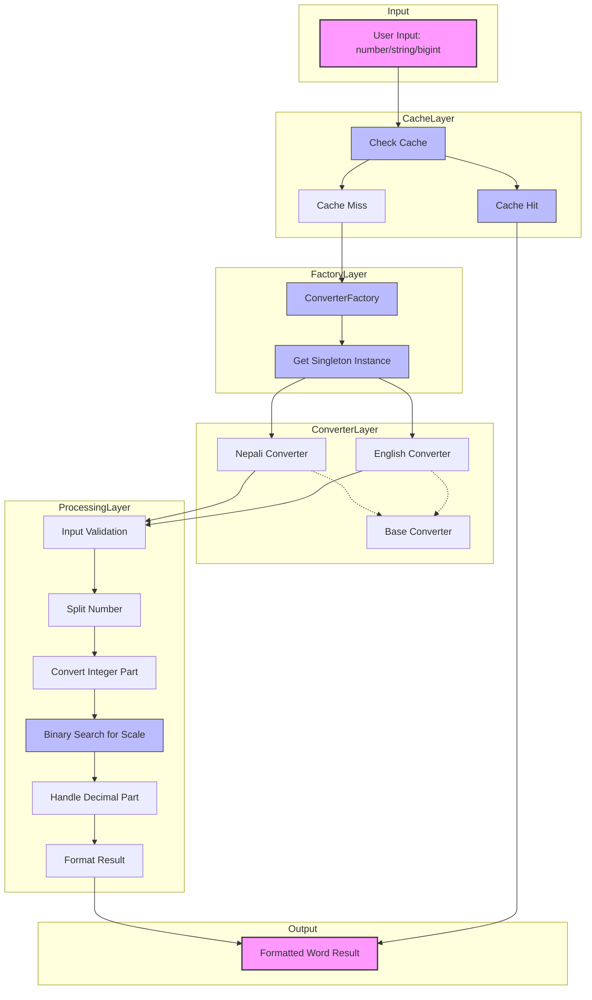
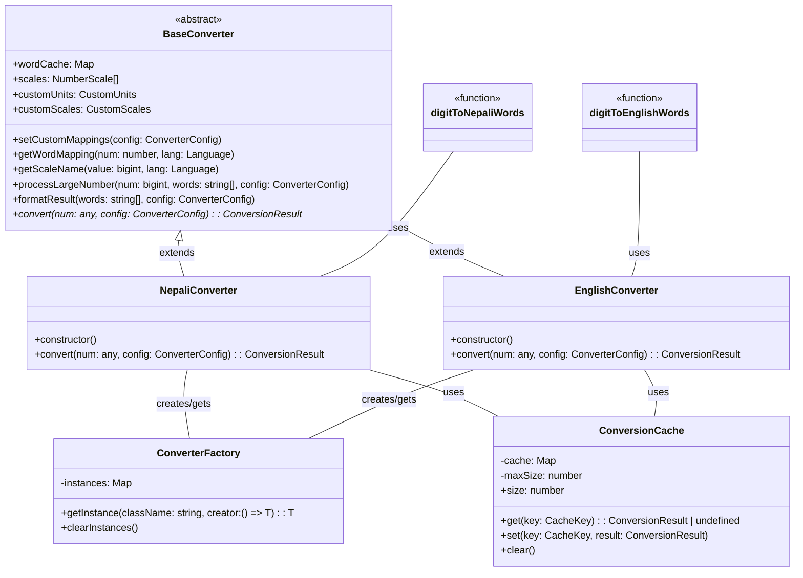

# digit-to-words-nepali

A TypeScript library to convert numbers into their word representations in English and Nepali languages. Supports numbers up to Adanta Singhar (10^39) with extensive currency and decimal formatting options.

## Features

- Convert numbers to words in English and Nepali languages
- Support for numbers up to `999...9` (39 nines), effectively `10^39 - 1`. Throws error for larger numbers or inputs with more than 39 digits (ignoring leading zeros).
- Native BigInt support for large numbers
- High-performance optimizations:
  - LRU caching for frequently converted values
  - Efficient singleton converter instances via factory pattern
  - Binary search algorithm for scale lookup (O(log n) complexity)
- Currency formatting with custom currency names
- Decimal number handling with configurable formats and refined rounding/zero logic
- Language-specific defaults
- Zero external dependencies
- Strict input validation
- Fully tested with comprehensive test cases

## Installation

```bash
npm install digit-to-words-nepali
```

## Usage Examples

### Basic Usage

```typescript
import { digitToNepaliWords } from "digit-to-words-nepali";

// Simple number conversion
digitToNepaliWords(1234); // "एक हजार दुई सय चौँतिस"

// With English output
digitToNepaliWords(1234, { lang: "en" });
// Output: "one thousand two hundred thirty four"

// Zero
digitToNepaliWords(0);
// Output: "शून्य"
```

### Currency Formatting

```typescript
// Default Nepali currency
digitToNepaliWords(1234.5, {
  isCurrency: true,
  includeDecimal: true,
});
// Output: "रुपैयाँ एक हजार दुई सय चौँतिस पैसा पचास"

// Custom currency in English
digitToNepaliWords(1234.05, {
  lang: "en",
  isCurrency: true,
  includeDecimal: true,
  currency: "dollars",
  currencyDecimalSuffix: "cents"
});
// Output: "dollars one thousand two hundred thirty four cents five"
```

### Large Numbers

```typescript
// Large number (1 Arab)
digitToNepaliWords(BigInt("1000000000"));
// Output: "एक अरब"

// Larger number (12 Kharab 34 Arab 56 Crore 78 Lakh 90 Thousand)
digitToNepaliWords(BigInt("1234567890000"));
// Output: "बाह्र खरब चौँतिस अरब छपन्न करोड अठहत्तर लाख नब्बे हजार"

// Very large number (1 Padma)
digitToNepaliWords(BigInt("1" + "0".repeat(15)));
// Output: "एक पद्म"

// Maximum supported number (39 nines)
const maxSupported = BigInt("9".repeat(39));
digitToNepaliWords(maxSupported);
// Output: "उनान्सय महासिंघर उनान्सय सिंघर ... नौ सय उनान्सय"

// Numbers larger than 10^39 - 1 will throw an error
try {
  digitToNepaliWords(BigInt("1" + "0".repeat(39))); // 1 followed by 39 zeros
} catch (e) {
  console.error(e.message); // Output: Input exceeds maximum supported value (10^39 - 1)
}

// Complex large number with English output
digitToNepaliWords(BigInt("987654321987654321"), { lang: "en" });
// Output: "nine shankha eighty seven padma sixty five neel forty three
//          kharab twenty one arab ninety eight crore seventy six lakh
//          fifty four thousand three hundred twenty one"

// Complex large number with Nepali output
digitToNepaliWords(BigInt("987654321987654321"));
// Output: "नौ शंख सतासी पद्म पैंसट्ठी नील त्रिचालीस खरब एक्काइस अरब अन्ठान्नब्बे करोड
//          छयहत्तर लाख चवन्न हजार तीन सय एक्काइस"
```

### Working with Negative Numbers
The library focuses on positive number conversion. For negative numbers, use this pattern:

```typescript
// Handle negative numbers in your application logic:
const num = -123;
const prefix = num < 0 ? "ऋणात्मक" : "";
const words = digitToNepaliWords(Math.abs(num));
console.log(`${prefix} ${words}`);
// Output: "ऋणात्मक एक सय तेइस"
```

### Decimal Handling

```typescript
// Regular decimal
digitToNepaliWords(1.23, { 
  includeDecimal: true 
});
// Output: "एक दशमलव तेइस"

// Custom decimal suffix
digitToNepaliWords(1.23, {
  lang: "en",
  includeDecimal: true,
  decimalSuffix: "point"
});
// Output: "one point twenty three"
```

### Decimal Handling Rules

The library follows these rules for decimal places:

1.  **Rounding**: If there are more than 2 decimal places, the number is rounded to 2 decimal places using standard rounding rules (>= .005 rounds up).
    ```typescript
    digitToNepaliWords(1.567, { includeDecimal: true })
    // => "एक दशमलव सन्ताउन्न"  (rounds to 1.57)

    digitToNepaliWords(1.999, { includeDecimal: true })
    // => "दुई"  (rounds to 2.00)

    digitToNepaliWords(0.009, { includeDecimal: true })
    // => "शून्य दशमलव एक" (rounds to 0.01)

    digitToNepaliWords(0.001, { includeDecimal: true })
    // => "शून्य" (rounds to 0.00)
    ```

2.  **Padding**: Single decimal digits are padded with a zero *after* rounding.
    ```typescript
    digitToNepaliWords(1.5, { includeDecimal: true })
    // => "एक दशमलव पचास"  (pads to 1.50)
    ```

3.  **Zero Decimals**: If the decimal part becomes `00` after rounding, it is omitted from the output unless the integer part is also zero.
    ```typescript
    digitToNepaliWords(1.001, { includeDecimal: true })
    // => "एक" (rounds to 1.00, decimal omitted)

    digitToNepaliWords(0.001, { includeDecimal: true })
    // => "शून्य" (rounds to 0.00, decimal omitted)
    ```

4.  **Currency Format**: These rules apply to both regular and currency formats.
    ```typescript
    digitToNepaliWords(1.567, {
      isCurrency: true,
      includeDecimal: true
    })
    // => "रुपैयाँ एक पैसा सन्ताउन्न"  (rounds to 1.57)

    digitToNepaliWords(1.5, {
      isCurrency: true,
      includeDecimal: true
    })
    // => "रुपैयाँ एक पैसा पचास"  (pads to 1.50)

    digitToNepaliWords(0.009, { isCurrency: true, includeDecimal: true })
    // => "रुपैयाँ शून्य पैसा एक" (rounds to 0.01)
    ```

## Configuration Options

### Basic Configuration
```typescript
interface ConverterConfig {
  lang?: "en" | "ne";           // Output language (default: "ne")
  isCurrency?: boolean;         // Format as currency (default: false)
  includeDecimal?: boolean;     // Include decimal part (default: true)
  currency?: string;            // Custom currency text (empty string omits prefix)
  decimalSuffix?: string;       // Custom decimal suffix (empty string omits suffix)
  currencyDecimalSuffix?: string; // Custom currency decimal suffix (empty string omits suffix)
  units?: Record<number, CustomMapping>;    // Custom number words
  scales?: Record<number, CustomMapping>;   // Custom scale words
}

// CustomMapping type for language-specific text
type CustomMapping = {
  en: string;  // English text
  ne: string;  // Nepali text
};
```

### Custom Mappings Example
```typescript
digitToNepaliWords(1234, {
  units: {
    1: { ne: "एक्का", en: "ekka" },
    2: { ne: "दुक्का", en: "dukka" }
  },
  scales: {
    1000: { ne: "हज्जार", en: "hazzar" }
  }
});
```

### Default Values

#### Nepali (lang: "ne")
```typescript
{
  currency: "रुपैयाँ",
  decimalSuffix: "दशमलव",
  currencyDecimalSuffix: "पैसा"
}
```

#### English (lang: "en")
```typescript
{
  currency: "Rupees",
  decimalSuffix: "point",
  currencyDecimalSuffix: "paisa"
}
```

## Best Practices

1.  For large numbers (> `Number.MAX_SAFE_INTEGER` or near the 39-digit limit), use `BigInt` strings or `BigInt` literals:
    ```typescript
    digitToNepaliWords(BigInt("12345678901234567890")); // Use BigInt
    digitToNepaliWords("9".repeat(39)); // Use string for max value
    ```

2.  Handle potential errors, especially for invalid inputs or numbers exceeding the maximum supported value:
    ```typescript
    try {
      // These will throw errors
      digitToNepaliWords(-123);        // Negative numbers
      digitToNepaliWords("abc");       // Non-numeric input
      digitToNepaliWords("1.2a");      // Invalid decimal
      digitToNepaliWords(NaN);         // NaN
      digitToNepaliWords(Infinity);    // Infinity
      digitToNepaliWords("1".repeat(40)); // Exceeds max length/value
    } catch (error) {
      console.error(error.message);
    }
    ```

3.  For currency values, typically set both flags:
    ```typescript
    digitToNepaliWords(amount, {
      isCurrency: true,
      includeDecimal: true, // Usually desired for currency
    });
    ```

4.  The library relies on standard `parseFloat` and `BigInt` behavior for parsing strings. Ensure your string inputs are valid representations.

## Number Scale Support

The library supports numbers up to `10^39 - 1`. Here's the complete scale used:

| Power | English        | Nepali      | Example                                                     |
| ----- | -------------- | ----------- | ----------------------------------------------------------- |
| 10^2  | hundred        | सय          | 100                                                         |
| 10^3  | thousand       | हजार        | 1,000                                                       |
| 10^5  | lakh           | लाख         | 1,00,000                                                    |
| 10^7  | crore          | करोड        | 1,00,00,000                                                 |
| 10^9  | arab           | अरब         | 1,00,00,00,000                                              |
| 10^11 | kharab         | खरब         | 1,00,00,00,00,000                                           |
| 10^13 | neel           | नील         | 1,00,00,00,00,00,000                                        |
| 10^15 | padma          | पद्म        | 1,00,00,00,00,00,00,000                                     |
| 10^17 | shankha        | शंख         | 1,00,00,00,00,00,00,00,000                                  |
| 10^19 | udpadh         | उपाध        | 1,00,00,00,00,00,00,00,00,000                               |
| 10^21 | ank            | अंक         | 1,00,00,00,00,00,00,00,00,00,000                            |
| 10^23 | jald           | जल्द        | 1,00,00,00,00,00,00,00,00,00,00,000                         |
| 10^25 | madh           | मध          | 1,00,00,00,00,00,00,00,00,00,00,00,000                      |
| 10^27 | paraardha      | परार्ध      | 1,00,00,00,00,00,00,00,00,00,00,00,00,000                   |
| 10^29 | ant            | अन्त        | 1,00,00,00,00,00,00,00,00,00,00,00,00,00,000                |
| 10^31 | maha ant       | महाअन्त     | 1,00,00,00,00,00,00,00,00,00,00,00,00,00,00,000             |
| 10^33 | shishant       | शिशान्त     | 1,00,00,00,00,00,00,00,00,00,00,00,00,00,00,00,000          |
| 10^35 | singhar        | सिंघर       | 1,00,00,00,00,00,00,00,00,00,00,00,00,00,00,00,00,000       |
| 10^37 | maha singhar   | महासिंघर    | 1,00,00,00,00,00,00,00,00,00,00,00,00,00,00,00,00,00,000    |
| 10^39 | adanta singhar | अदन्त सिंघर | 1,00,00,00,00,00,00,00,00,00,00,00,00,00,00,00,00,00,00,000 |

## Architecture and Flow

The following diagram illustrates the high-level architecture and data flow of the `digit-to-words-nepali` library with all optimizations:



The diagram shows the optimized architecture with:

1. **Caching Layer**: LRU cache for frequently converted numbers
2. **Factory Layer**: Singleton pattern for efficient converter instances
3. **Converter Layer**: Base/Specialized converter hierarchy
4. **Processing Layer**: The core conversion logic with optimizations like binary search
5. **Input/Output**: User-facing interfaces

The optimized architecture provides significant performance improvements while maintaining the same API and functionality.

### Optimization Details

The library includes several key optimizations that improve performance:

```mermaid
flowchart LR
    subgraph "Before Optimization"
        A1[Linear Scanning\nfor Scale Values]
        B1[New Converter\nInstance Each Call]
        C1[Repeated Calculations\nfor Same Values]
    end

    subgraph "After Optimization"
        A2[Binary Search\nO(log n) Complexity]
        B2[Singleton Factory Pattern\nReused Instances]
        C2[LRU Caching\nFast Lookups]
    end

    A1 -->|Optimized| A2
    B1 -->|Optimized| B2
    C1 -->|Optimized| C2

    classDef before fill:#ffcccc,stroke:#333;
    classDef after fill:#ccffcc,stroke:#333;
    class A1,B1,C1 before;
    class A2,B2,C2 after;
```

These optimizations are particularly impactful for:
- Applications that convert the same numbers repeatedly
- Handling very large numbers with many scale transitions
- Systems with high throughput requirements
- Mobile or resource-constrained environments

### Class Structure

The following diagram illustrates the structure and relationships between the different classes and components:



This class structure allows for code reuse, maintainability, and the performance optimizations described above.

## License

BSD 3-Clause License - see LICENSE file for details.

## Contributing

Contributions welcome! Please check our contributing guidelines.

<a href="https://github.com/codernirdesh/digit-to-words-nepali/graphs/contributors">
  
</a>

## Support

For issues and questions, please [open an issue](https://github.com/codernirdesh/digit-to-words-nepali/issues).
